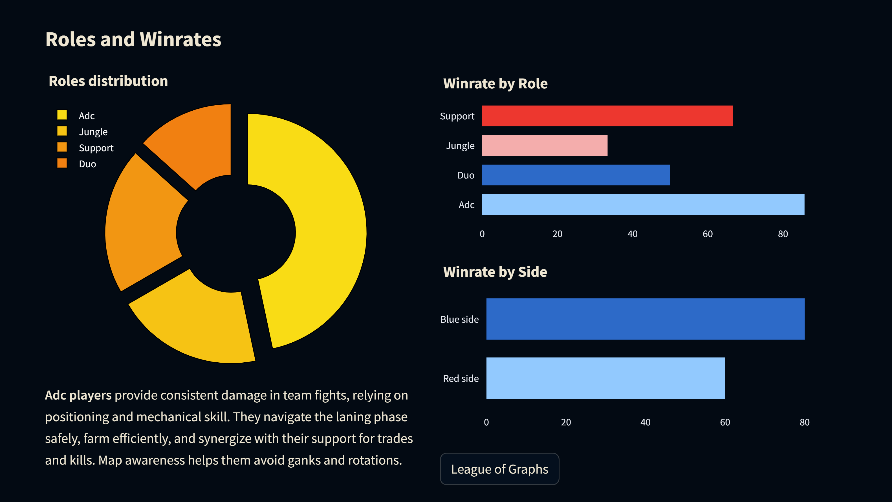

# Porostream - League of Legends Dashboard 

**Update** (26 Feb 2024): Visit the web application at [Porostream](https://porostream.streamlit.app/)

## About the project

Porostream is a compact system for gathering and organizing game statistics data from [Riot API](https://developer.riotgames.com/).

In short, it allows you to:

* Retrieve player statistics such as match history, ranked information, or even custom data of your choice.
* Store the data in a scalable database using technologies like [PostgreSQL](https://www.postgresql.org/) and [SQLAlchemy](https://www.sqlalchemy.org/).
* Utilize various tools to model and analyze the behavioral data.
* Generate reports and deploy an online dashboard for convenient management.

## Porostream Techstack 101

The repository structure follows the conceptual architecture of Porobot, which consists of four loosely-coupled sub-systems.

To briefly explain these four sub-systems:

* **[Extractor][extractor]** employs `Pydantic` to validate the integrity and quality of the extracted Riot data through customizable data quality checks and adherence to expected schema and format.
* **[Storage][storage]** relies on `SQLite` as a robust and feature-rich database system for persistent storage of Riot and Discord data, while leveraging `SQLAlchemy` as the ORM tool for simplified interaction with the database.
* **[Analytics][analytics]** employs `Plotly` for creating interactive and visually appealing data visualizations, `Pandas` for data transformation and analysis, and `Discord` for deploying intuitive and user-friendly dashboards to explore and analyze Riot data.
* **[Application][app]** utilizes `Streamlit` as the library for building a data science web app, providing a powerful and efficient framework for interacting with `Riot API` and creating engaging and interactive experiences for users.

## Documentation

Since Porostream is built on the basis of `RiotAPI` library, it is essential to look for the library documentation for further implementation. 

- `RiotAPI`: https://developer.riotgames.com/
- `Streamlit`: https://docs.streamlit.io/

[orchestrator]: https://www.prefect.io/
[extractor]: https://developer.spotify.com/documentation/web-api
[storage]: https://www.postgresql.org/
[analytics]: https://resonance.streamlit.app/
[app]: https://www.hikari-py.dev/